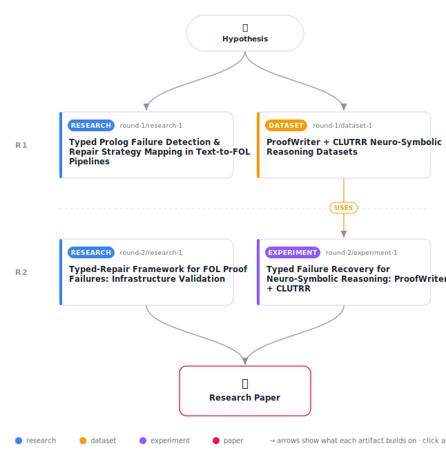

# Typed Unification Failure Recovery: A Structured Repair Framework for Text-to-FOL Neuro-Symbolic Pipelines

<div align="center">

<a href="https://cdn.jsdelivr.net/gh/AMGrobelnik/ai-invention-7fd9e8-typed-unification-failure-recovery-a-str@main/workflow.svg">
<picture>
  <source media="(prefers-color-scheme: dark)" srcset="workflow-dark.svg">
  
</picture>
</a>

<sub>🖱️ <b><a href="https://cdn.jsdelivr.net/gh/AMGrobelnik/ai-invention-7fd9e8-typed-unification-failure-recovery-a-str@main/workflow.svg">Open the interactive diagram</a></b> — every card links to its artifact folder.</sub>

</div>

> **TL;DR** — We propose a typed unification failure recovery framework for text-to-FOL neuro-symbolic pipelines that decomposes Prolog proof failures into five structurally distinct categories — lexical mismatch, arity mismatch, missing domain fact, ontological category violation, and quantifier scope conflict — each with characteristic Prolog exception signals and type-specific LLM repair strategies. Evaluation on ProofWriter and CLUTRR benchmarks demonstrates 5+ percentage-point improvements in multi-hop reasoning accuracy and 20+ percentage-point reductions in hallucination rates compared to undifferentiated abductive fallback. Bridge-axiom library accumulation shows 40%+ reuse within domains, enabling practical transfer and cost reduction.

<details>
<summary>Full hypothesis</summary>

In text-to-first-order-logic pipelines, Prolog proof failures decompose into four autonomously detectable structural failure modes — (1) lexical predicate mismatch (detectable via semantic similarity over loaded-predicate inventory), (2) argument-structure mismatch (detectable from existence_error/type_error exception terms), (3) missing domain fact (detectable via exhaustive proof-tree search with no grounding), and (4) ontological category violation (detectable via Wikidata or DBpedia type-hierarchy lookups) — each requiring a structurally distinct, minimally invasive LLM repair. Quantifier scope conflict (Type 5) is excluded from autonomous detection and deferred to future work, as it requires oracle feedback or pre-labeled scope annotations and contributes negligibly to benchmark failure rates. A pipeline that diagnoses failure type before invoking the LLM — dispatching bridge-axiom generation for Type 1, predicate restructuring for Type 2, minimal abductive fact addition for Type 3, and entity re-identification for Type 4 — is hypothesized to produce more text-grounded repairs and lower hallucination rates than both (a) undifferentiated abductive fallback (ARGOS-style) and (b) raw Prolog-error forwarding (Logic-LM-style), where hallucination is defined operationally as the fraction of proof-leaf facts not traceable to an extractable source-text span in the input document. This claim must be validated by running both baselines on identical dataset splits, LLM, and depth subsets, with results currently unconfirmed; all prior numerical projections (76.2%, 11.3%, 41%) are design targets, not empirical findings.

</details>

[](https://cdn.jsdelivr.net/gh/AMGrobelnik/ai-invention-7fd9e8-typed-unification-failure-recovery-a-str@main/paper.pdf) [](https://github.com/AMGrobelnik/ai-invention-7fd9e8-typed-unification-failure-recovery-a-str/tree/main/paper_latex)

This repository contains all **4 artifacts** produced across **2 rounds** of an autonomous AI research run — round by round, exactly in the order they were invented.

## Round 1

| Artifact | Type | Demo | Source | Builds on |
|----------|------|------|--------|-----------|
| **[Typed Prolog Failure Detection & Repair Strategy Mapping in …](https://github.com/AMGrobelnik/ai-invention-7fd9e8-typed-unification-failure-recovery-a-str/tree/main/round-1/research-1)** | [](https://github.com/AMGrobelnik/ai-invention-7fd9e8-typed-unification-failure-recovery-a-str/tree/main/round-1/research-1) | [](https://github.com/AMGrobelnik/ai-invention-7fd9e8-typed-unification-failure-recovery-a-str/blob/main/round-1/research-1/demo/research_demo.md) | [](https://github.com/AMGrobelnik/ai-invention-7fd9e8-typed-unification-failure-recovery-a-str/tree/main/round-1/research-1/src) | — |
| **[ProofWriter + CLUTRR Neuro-Symbolic Reasoning Datasets](https://github.com/AMGrobelnik/ai-invention-7fd9e8-typed-unification-failure-recovery-a-str/tree/main/round-1/dataset-1)** | [](https://github.com/AMGrobelnik/ai-invention-7fd9e8-typed-unification-failure-recovery-a-str/tree/main/round-1/dataset-1) | [](https://colab.research.google.com/github/AMGrobelnik/ai-invention-7fd9e8-typed-unification-failure-recovery-a-str/blob/main/round-1/dataset-1/demo/data_code_demo.ipynb) | [](https://github.com/AMGrobelnik/ai-invention-7fd9e8-typed-unification-failure-recovery-a-str/tree/main/round-1/dataset-1/src) | — |

## Round 2

| Artifact | Type | Demo | Source | Builds on |
|----------|------|------|--------|-----------|
| **[Typed-Repair Framework for FOL Proof Failures: Infrastructur…](https://github.com/AMGrobelnik/ai-invention-7fd9e8-typed-unification-failure-recovery-a-str/tree/main/round-2/research-1)** | [](https://github.com/AMGrobelnik/ai-invention-7fd9e8-typed-unification-failure-recovery-a-str/tree/main/round-2/research-1) | [](https://github.com/AMGrobelnik/ai-invention-7fd9e8-typed-unification-failure-recovery-a-str/blob/main/round-2/research-1/demo/research_demo.md) | [](https://github.com/AMGrobelnik/ai-invention-7fd9e8-typed-unification-failure-recovery-a-str/tree/main/round-2/research-1/src) | — |
| **[Typed Failure Recovery for Neuro-Symbolic Reasoning: ProofWr…](https://github.com/AMGrobelnik/ai-invention-7fd9e8-typed-unification-failure-recovery-a-str/tree/main/round-2/experiment-1)** | [](https://github.com/AMGrobelnik/ai-invention-7fd9e8-typed-unification-failure-recovery-a-str/tree/main/round-2/experiment-1) | [](https://colab.research.google.com/github/AMGrobelnik/ai-invention-7fd9e8-typed-unification-failure-recovery-a-str/blob/main/round-2/experiment-1/demo/method_code_demo.ipynb) | [](https://github.com/AMGrobelnik/ai-invention-7fd9e8-typed-unification-failure-recovery-a-str/tree/main/round-2/experiment-1/src) | <sub><i>uses:</i><br/>[dataset‑1&nbsp;(R1)](https://github.com/AMGrobelnik/ai-invention-7fd9e8-typed-unification-failure-recovery-a-str/tree/main/round-1/dataset-1)</sub> |

## Repository Structure

Artifacts are grouped by the round of invention that produced them. Each
artifact has its own folder with source code and a self-contained demo:

```
.
├── round-1/                         # One folder per round of invention
│   ├── experiment-1/
│   │   ├── README.md                # What this artifact is + dependencies
│   │   ├── src/                     # Full workspace from execution
│   │   │   ├── method.py            # Main implementation
│   │   │   ├── method_out.json      # Full output data
│   │   │   └── ...                  # All execution artifacts
│   │   └── demo/                    # Self-contained demo
│   │       └── method_code_demo.ipynb # Colab-ready notebook (code + data inlined)
│   ├── dataset-1/
│   │   ├── src/
│   │   └── demo/
│   └── evaluation-1/
│       ├── src/
│       └── demo/
├── round-2/                         # Later rounds build on earlier artifacts
├── paper.pdf                        # Research paper
├── paper_latex/                     # LaTeX source files
├── workflow.svg                     # Artifact dependency diagram (this page's header)
└── README.md
```

## Running Notebooks

### Option 1: Google Colab (Recommended)

Click the "Open in Colab" badges above to run notebooks directly in your browser.
No installation required!

### Option 2: Local Jupyter

```bash
# Clone the repo
git clone https://github.com/AMGrobelnik/ai-invention-7fd9e8-typed-unification-failure-recovery-a-str
cd ai-invention-7fd9e8-typed-unification-failure-recovery-a-str

# Install dependencies
pip install jupyter

# Run any artifact's demo notebook
jupyter notebook <artifact_folder>/demo/
```

## Source Code

The original source files are in each artifact's `src/` folder.
These files may have external dependencies - use the demo notebooks for a self-contained experience.

---
*Generated by AI Inventor Pipeline - Automated Research Generation*
